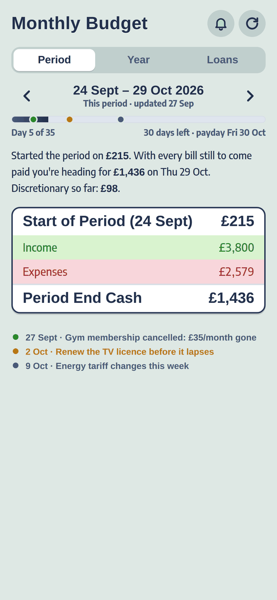
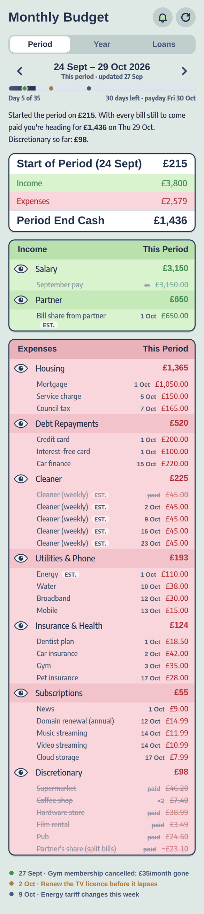
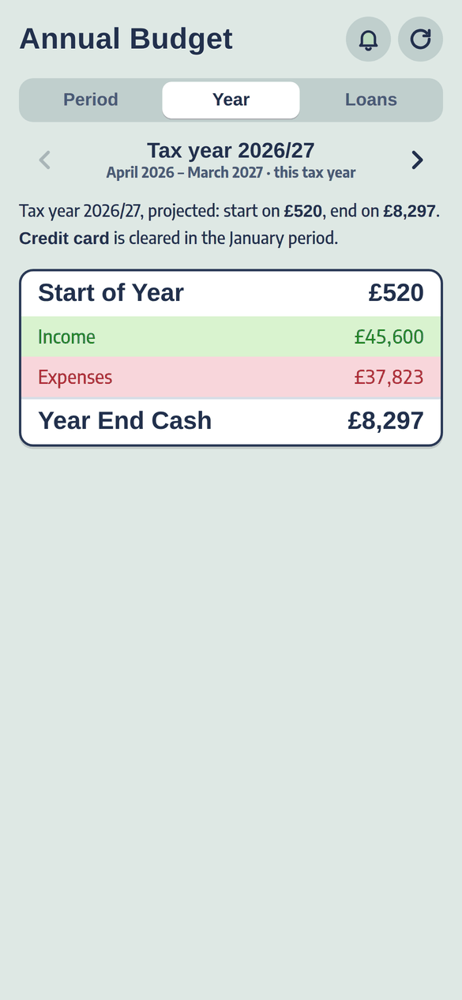
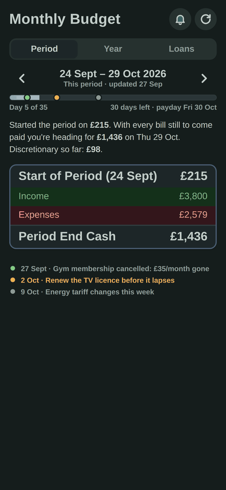

# Budget Panel

A personal budget that Claude keeps up to date for you every morning, shown as a SimCity 4-style
budget screen on your phone.

<p>
  
  
  
  
</p>

*All the numbers in these screenshots are made up ([`examples/demo-budget.json`](examples/demo-budget.json)).*

## What it is

Most budgeting apps ask you to categorise transactions and then show you charts of the past. This
one answers a single question: **how much will be in my account the day before I next get paid?**

Each morning a scheduled Claude routine:

1. reads your bank balances and new transactions through a bank connector,
2. works out what each payment was (searching your email for receipts when it doesn't recognise one),
3. updates the budget: ticks off bills that went out, itemises every bit of discretionary spending,
   updates debt balances, and rolls over to a new period on payday,
4. writes you a short brief in the chat, and
5. sends a push notification to your phone with the headline number and the one thing that needs
   doing.

You look at the result on your phone, in the Budget Panel app, or in a Claude artifact.

## The model

Everything revolves around the **pay period**: from the day before payday to the day before the next
payday. That's when your balance is at its lowest, so it's the number that matters.

```
Start of Period  (balance just before your salary lands)
+ Income         (salary, partner's bill share, refunds…)
− Expenses       (bills, debt payments, and every discretionary spend so far)
= Period End Cash
```

- **Planned items** (salary, bills, debt payments) come from a recurring **plan**: monthly on a day,
  weekly, on payday, or one-off / annual on a date.
- **Discretionary spending is never forecast.** It only appears once you've spent it, so the
  forecast shows what you'd have left if you spent nothing more. Every card payment is itemised,
  and any unexplained difference shows up as "not itemised yet".
- **Future periods** are projected from the plan for five years, including debts: each debt's balance
  is simulated with monthly interest, and its payments stop once it hits £0.
- **Past periods** come from your bank statement (see [`tools/backfill.py`](tools/backfill.py)) and
  then from each payday rollover.

## Features

- **Period / Year / Loans tabs.** Swipe or use the arrows to move between past periods, the current
  one and projections. The Year tab groups pay periods by UK tax year (April to March). The Loans tab
  shows each debt's balance, % paid off and the date the forecast clears it.
- **Tap the total** to open the income and expenses breakdown; tap a group to see its items.
  Estimates are tagged "est.", and paid items say "paid".
- **Timeline notes.** The daily routine pins notes on the period's progress bar (amber = something to
  do, green = good news) and lists them at the bottom.
- **Push notifications** (Web Push with VAPID, written from scratch with WebCrypto: no dependencies).
  The routine queues a message in the database and the server sends it within a minute. Messages can
  be scheduled for later.
- **Installable phone app (PWA)** with light and dark mode, offline copy, no pinch zoom or bounce.
- **Private by default.** Sign-in is an emailed one-time code for your address only: Cloudflare
  Access (checked again by the Worker), or Supabase Auth on Vercel.
- **Two ways to host it:** Cloudflare (Workers + D1 + Access), or Vercel + Supabase. Same app, same
  features.
- **A Claude artifact** that renders the same budget with the same code, inside Claude.

## How it fits together

```
                  ┌─────────────────────────────── Claude (Claude Code on the web) ─────────────────────────────┐
  bank connector ─┤  Daily routine (07:50): read balances + transactions, check email, update the budget JSON   │
  email connector ┤  CLAUDE.md = working memory (your debts, bills, rules, decisions)                         │
                  └───────────────┬──────────────────────────────────────────────┬──────────────────────────────┘
                                  │ writes budget JSON                           │ writes budget JSON
                                  ▼                                              ▼
                   Claude artifact database                     Cloudflare D1 (docs, push_subs, notifications)
                   `budget/current`                                              │
                                  │                                              ▼
                                  ▼                              Cloudflare Worker behind Cloudflare Access
                   artifact.html + panel.js ◄── same code ──►   serves the PWA, /api/budget, push sign-up,
                   (view inside Claude)                          cron: sends queued notifications
                                                                                 │
                                                                                 ▼
                                                                  Your phone (Home Screen app + push)
```

On Vercel + Supabase the right-hand side is Supabase Postgres instead of D1 and Vercel Functions
instead of the Worker, with Supabase Auth for sign-in and Supabase's `pg_cron` calling the delivery
endpoint every minute.

| Path | What it is |
|---|---|
| [`app/`](app/) | The Cloudflare Worker and the phone app (`public/`). `panel.js` + `panel.css` hold all the rendering and the projection engine. |
| [`app/schema.sql`](app/schema.sql) | The D1 tables. |
| [`api/`](api/), [`vercel.json`](vercel.json) | The Vercel Functions: the same API, backed by Supabase. |
| [`platforms/vercel-supabase/`](platforms/vercel-supabase/) | Supabase schema (and the every-minute schedule), the Supabase sign-in, the Vercel build step. |
| [`artifact/artifact.html`](artifact/artifact.html) | The Claude artifact shell that loads the same `panel.js` / `panel.css`. |
| [`templates/CLAUDE.md`](templates/CLAUDE.md) | A starting point for Claude's working memory about your finances. |
| [`templates/daily-routine.md`](templates/daily-routine.md) | The prompt for the daily routine. |
| [`tools/backfill.py`](tools/backfill.py) | Builds past periods from a bank statement CSV. |
| [`tools/gen-vapid.mjs`](tools/gen-vapid.mjs) | Generates the push notification keys. |
| [`tools/preview.mjs`](tools/preview.mjs) | Runs the app locally with example data. |
| [`examples/demo-budget.json`](examples/demo-budget.json) | A complete, made-up budget document. |
| [`docs/`](docs/) | Setup guide, data model, and how the Claude side works. |

## Try it in two minutes

You need Node 18 or newer. No install step:

```sh
node tools/preview.mjs
# open http://localhost:8787
```

This serves the app with the demo budget. Point it at your own file with
`node tools/preview.mjs path/to/budget.json`.

## Set it up for yourself

Pick a host:

- **Cloudflare** (the original): **[docs/setup.md](docs/setup.md)**. A domain on Cloudflare, a D1
  database, a Cloudflare Access application for your email, VAPID keys, then `npx wrangler deploy`.
- **Vercel + Supabase**: **[docs/vercel-supabase.md](docs/vercel-supabase.md)**. A Supabase project
  (tables, one user, sign-ups off), VAPID keys, then import the repo into Vercel with a few
  environment variables. No domain needed.

Then, whichever host:

1. **Your data**: a private repo for your finances with `CLAUDE.md` (from the template) and your
   first budget document (start from the demo, or backfill history from a statement).
2. **Claude**: Claude Code on the web with a bank connector and an email connector, the Budget Panel
   artifact, and the daily routine created from the template prompt.

How the Claude side works, and how to talk to it, is in **[docs/claude.md](docs/claude.md)**.
The budget JSON is documented in **[docs/data-model.md](docs/data-model.md)**.

## Costs

Either host fits in its free plan: Cloudflare (Workers, D1, Access for up to 50 users; you'll need
a domain on Cloudflare), or Vercel Hobby + Supabase Free (no domain needed). The Claude side needs a Claude plan that includes Claude Code on the web and
scheduled routines, plus whatever your bank connector charges.

## Keep your data private

This repo contains **code only**. Your budget document, `CLAUDE.md`, statements and the routine prompt
hold your real finances: keep them in a **private** repo, and never commit the VAPID private key, a
Cloudflare API token or a Supabase secret key. Your budget is only served to a signed-in address
you've allowed.

It's UK-flavoured: pounds, `en-GB` dates, UK tax years, and a payday rule of "last Friday of the
month, brought forward off bank holidays" (Christmas, Boxing Day, New Year's Day and Good Friday).
Change `paydayOf` in `panel.js` if yours differs; see [docs/setup.md](docs/setup.md#customising).

## Licence

MIT. See [LICENSE](LICENSE).
