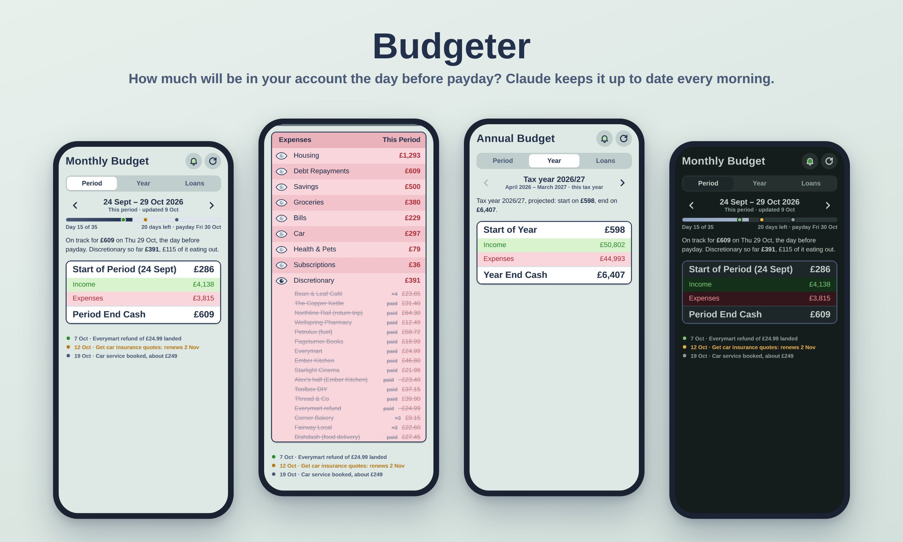
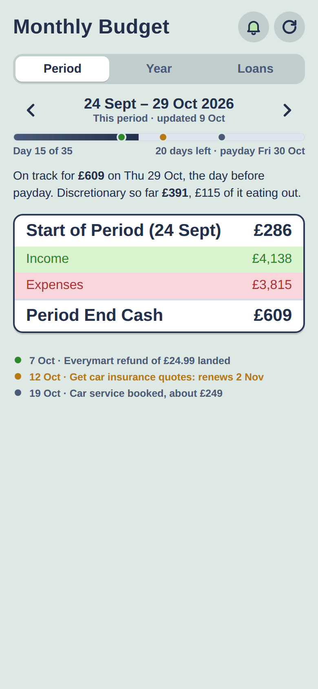
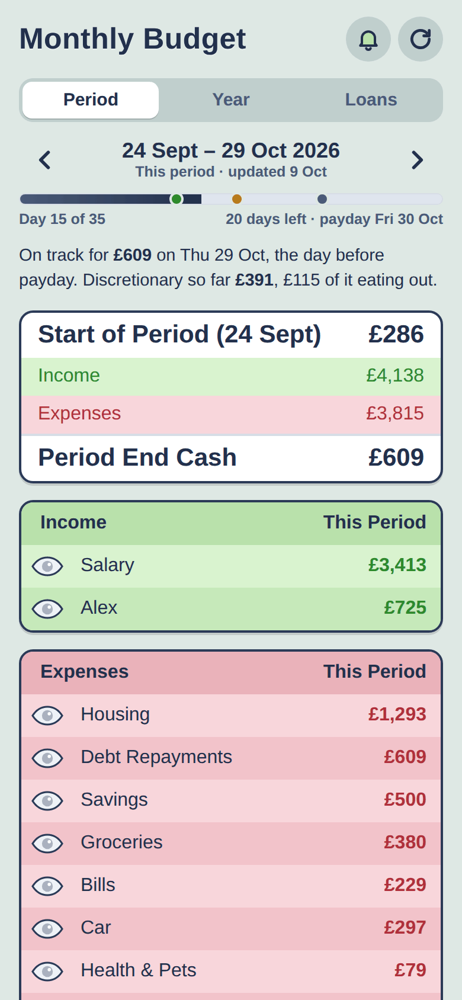
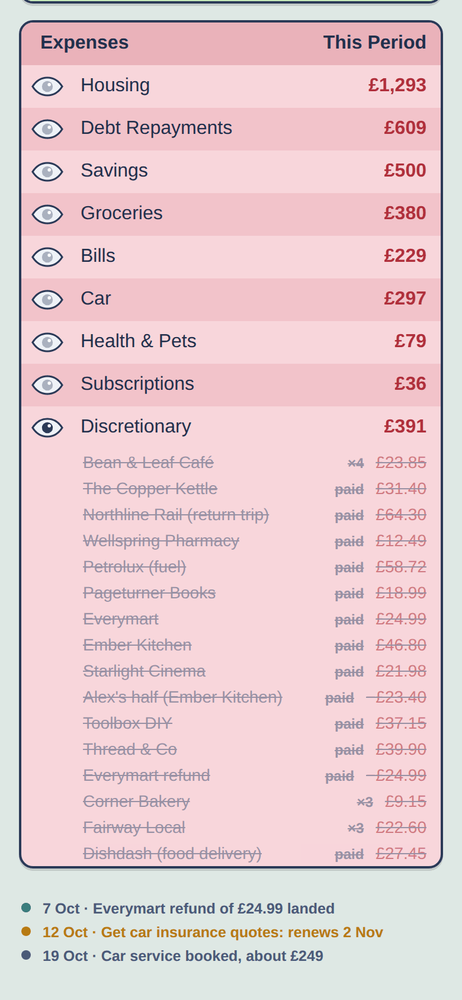
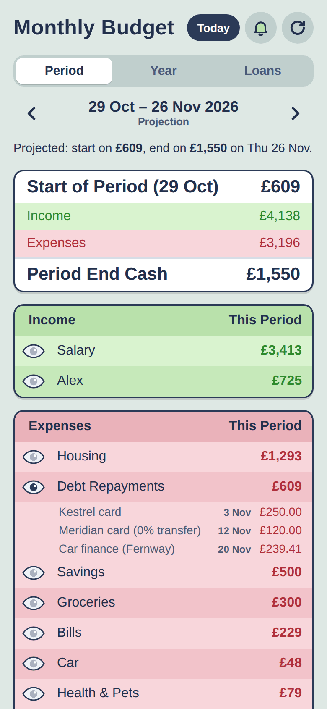
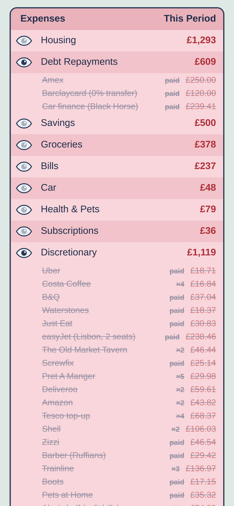
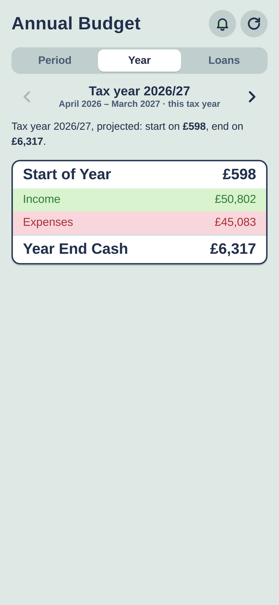
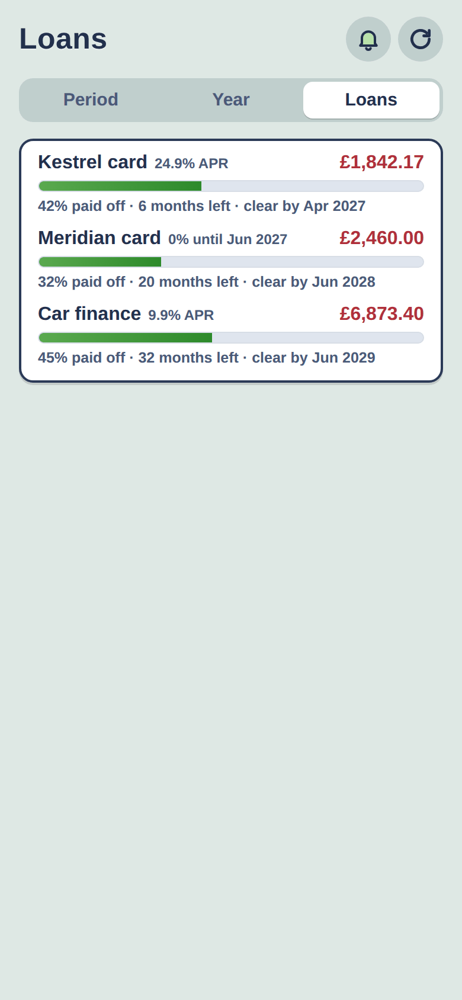
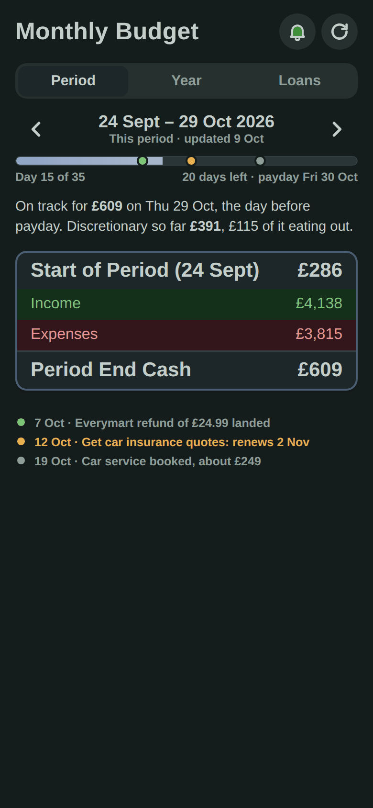
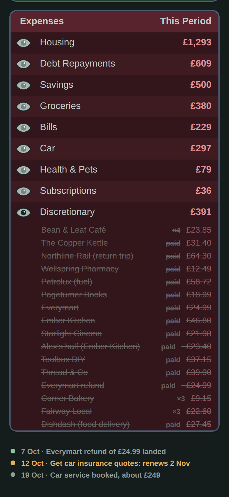

# Budgeter

A personal budget that Claude keeps up to date for you every morning, on your phone.

*Demo data ([`examples/demo-budget.json`](examples/demo-budget.json)).*

## What it is

Most budgeting apps ask you to categorise transactions and then show you charts of the past. This one
answers a single question: **how much will be in my account the day before I next get paid?**

Every morning a scheduled Claude routine reads your bank and new transactions, works out what each
payment was (checking your email for receipts), ticks off bills, itemises every bit of spending,
updates your debts, and sends a notification to your phone with the headline number and the one
thing that needs doing. Everything else is on the phone app: this pay period, forecasts for five
years, past periods, your tax year and your loans.

## Get started

You don't set this up by hand. Open your coding agent (built for Claude Code; any agent that can run
commands will manage) and say:

> Set up Budgeter for me on **Vercel + Supabase** (or **Cloudflare**):
> https://github.com/andytango/budgeter

The agent follows [AGENTS.md](AGENTS.md). It asks a few questions (which host, your private repo, your
email, how you're paid), builds the app into your private repo, provisions the database and sign-in,
deploys, loads your first budget, and creates the daily routine. It stops only for the things you have
to do yourself, like creating an access token or signing in on your phone.

**You'll need:**
- a Claude plan with Claude Code on the web and scheduled routines,
- a bank connector for Claude (e.g. Era Context) or statement exports, and an email connector,
- a private GitHub repo for your finances,
- a free **Vercel + Supabase** account pair, or a **Cloudflare** account with a domain on it.

Hosting fits in the free plans. To look first: `node tools/preview.mjs`, then open
http://localhost:8787 to see the demo (Node 20+, no install).

## Features

- **Period / Year / Loans tabs.** Swipe or use the arrows to move between past periods, the current
  one and projections. The Year tab groups pay periods by UK tax year (April to March). The Loans tab
  shows each debt's balance, % paid off and the date the forecast clears it.
- **Tap the total** to open the income and expenses breakdown; tap a group to see its items.
  Estimates are tagged "est.", and paid items say "paid".
- **Timeline notes.** The daily routine pins notes on the period's progress bar (amber = something to
  do, green = good news) and lists them at the bottom.
- **Push notifications**: the daily brief, plus reminders scheduled for later ("remind me Friday at
  8 to move the supermarket collection").
- **Installable phone app (PWA)** with light and dark mode, offline copy, no pinch zoom or bounce.
- **Private by default.** Sign-in is an emailed one-time code for your address only: Cloudflare
  Access (checked again by the Worker), or Supabase Auth on Vercel.
- **Two ways to host it:** Cloudflare (Workers + D1 + Access), or Vercel + Supabase. Same app, same
  features.
- **A Claude artifact** that renders the same budget with the same code, inside Claude.

## Using it

Talk to Claude in your finance repo, the same place the routine runs. For example:
- "I've cancelled Disney+." It comes off the plan, and Claude watches for it coming back.
- "Add a monthly haircut, about £40 mid-month." It becomes a planned bill.
- "How did this period go negative?" or "What's driving the year-end number?" You get a breakdown.
- "I'm borrowing £100 from my partner until payday." It goes in as income now and a repayment on payday.
- "Move the notes to the bottom of the screen." Claude changes the app and redeploys it.

## Screenshots

| | | |
|:-:|:-:|:-:|
|  |  |  |
| **This period.** Where you'll land the day before payday, with notes from the daily check. | **Tap the total** for income and expenses by group. | **Every spend itemised**, including your partner's half and refunds. |
|  |  |  |
| **Swipe forward** for forecasts: bills and debt payments from the plan. | **Swipe back** through past periods, built from your statements. | **The tax year**, and each one after it for five years. |
|  |  |  |
| **Loans:** how much is paid off and when each one clears. | **Dark mode** follows your phone. | |

## Privacy

This repo is code only. Your budget, statements and settings live in your own private repo and your
own database, and only a signed-in address you've allowed can see the budget. Claude reads your bank
and email read-only: it never moves money or sends email. How it's put together and secured:
[docs/architecture.md](docs/architecture.md).

## Repo layout

| Path | What |
|---|---|
| [`AGENTS.md`](AGENTS.md) | The setup playbook for coding agents. |
| [`app/`](app/) | The phone app. |
| [`server/`](server/) | The API and push notifications, shared by every host. |
| [`platforms/`](platforms/) | One folder per host: adapter code, schema, `SETUP.md` runbook. |
| [`claude/`](claude/) | Templates for Claude's memory and the daily routine; the Claude artifact. |
| [`tools/`](tools/) | Create, validate, seed, backfill, preview. |
| [`docs/`](docs/) | [Data model](docs/data-model.md), [architecture](docs/architecture.md), screenshots. |
| [`examples/`](examples/) | A complete, made-up budget. |
| [`tests/`](tests/) | `npm test`. |

UK defaults (pounds, UK tax year, paid on the last Friday of the month): your agent can change them.

## Licence

MIT. See [LICENSE](LICENSE).

---

P.S. If the look feels oddly familiar: it's lovingly lifted from SimCity 4's budget screen. Balancing
the household books should be at least as satisfying as balancing a city's, and with fewer riots.
